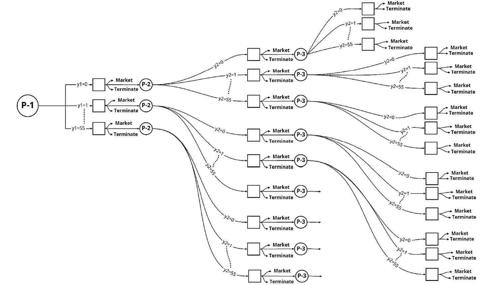

Decision Tree Implementation Using First Principles
===================================================

This project was performed to analyze a hypothetical scenario, where a decision is to be made if the Burger King at the University of Waterloo location (150 University Ave W) should launch a Beyond Meat Whopper burger as a four-month trial program. 

This decision was to be made by conducting a series of surveys and building a decision tree based on the survey results. The decision tree was then solved through expected value and expected utility analysis to determine profit and market share for the burger. Using the results, an effective marketing strategy was developed to maximize expected profit and expected utility for the four-month period.

The decision tree is solved using first principles through Bayesian inferencing programmed in MATLAB. The tree analyzed in this project is shown in the figure below. P1, P2 and P3 represent three survey phases, with 55 surveys conducted at each phase.

Important assumptions for this problem include discrete market share values and Bernoulli distribution of survey results.

This project was a submission for MSCI 442 - Decision Making Under Uncertainty
